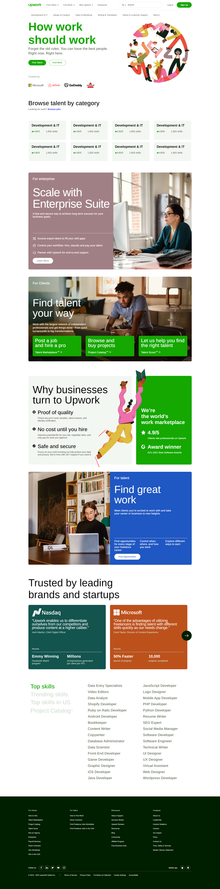

  

<h1 align="center">
</h1>

<h3 align="center">
  Landing Page | Clone
</h3>

  

Upwork Landing Page Clone - A Comprehensive HTML/CSS/JS Code Repository  
Upwork is a popular freelancing platform that connects businesses and individuals with talented freelancers from around the world. As an aspiring web developer, you may want to learn how to create a landing page similar to Upwork. In this repository, you will find a comprehensive HTML/CSS/JS code that can be used to clone the Upwork landing page.  
In conclusion, this repository is an excellent resource for web developers who want to learn how to create a landing page similar to Upwork. With a complete HTML/CSS/JS codebase, the code is easy to customize, responsive, cross-browser compatible, and SEO friendly. Whether you are a beginner or an experienced web developer, this repository provides an excellent opportunity to learn new skills and improve your web development abilities. So, go ahead and explore the code, and start creating amazing landing pages today!

  
<!-- ................................................................................................................................. -->

### Features
 
Following are some of the new features and learning encountered while creating this amazing project:

- <b>Complete codebase:</b>  The repository contains a complete codebase that can be used to clone the Upwork landing page. The code includes HTML, CSS, and JS files that can be easily modified to match your design requirements.
- <b>Easy to customize:</b>  The code is well-structured and easy to customize, allowing you to change the color, font, and other elements to match your branding and design requirements.

- <b>Cross-browser compatibility:</b>  The code is tested and optimized for cross-browser compatibility, ensuring that it works seamlessly on all modern web browsers.

- <b>SEO friendly:</b>  The code is optimized for search engines, ensuring that your landing page ranks higher on search engine results pages.

- <b>Comprehensive documentation:</b>  The repository includes comprehensive documentation that explains the code structure and provides instructions on how to customize the code to your needs.

- Regularly updated:</b>  The repository is regularly updated with new features and bug fixes, ensuring that you always have access to the latest version of the code.

  
<!-- ................................................................................................................................. -->

### Demo

  The Demo of this working project can be found on  
  <a href="https://rebrand.ly/Upwork_MABCORP">rebrand.ly/Upwork_MABCORP</a>

  
<!-- ................................................................................................................................. -->

### Video

You can exclusively watch the video on this project from the making to deploying on my channel with the link given below 

  [Video Link](# )  

  If you like my video then do Like the Video and share it with others.

  
<!-- ................................................................................................................................. -->

### GUI

  
<!-- ................................................................................................................................. -->

### Technology Stack
 
Follwing technologies have been used at the core of this application to make it stand in the market place:

- HTML
- CSS
- JavaScript

  
<!-- ................................................................................................................................. -->

### Advancement

> - The Website is not responsive on all kind of screens

  
<!-- ................................................................................................................................. -->

### Deployment Details

The website is deployed using the free hosting provided by **Vercel**

  

  
Later on the link was customized using the well-known URL shortener and customizer **Rebrandly**:  

  

  
<!-- ................................................................................................................................. -->

### Developer

Muhammad Abdullah Butt  
abdullahbutt12292210@gmail.com  
> [Instagram](https://www.instagram.com/abdullah.butt.22/) 
> [FaceBook](https://www.facebook.com/profile.php?id=100076291614529) 
> [YouTube](https://www.youtube.com/channel/UCnuOFQyMywg-KuoN-lmav1Q) 
> [Portfolio](https://rebrand.ly/MuhammadAbdullahButt_MABCORP) 
> [Project Displayer]( https://rebrand.ly/ProjectDisplayer_MABCORP)
  
<!-- ................................................................................................................................. -->

